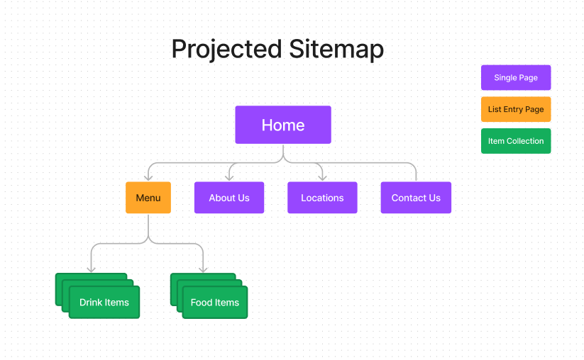

# Turkish Restaurant Project
Author: Rustu Mesut Eser
## Summary
Client wants to have a website for his Turkish restaurant. Client has several stores of restaurant. He wants to put restaurant's food and drink menu onto the website, including their image and price.

Considering client's needs, website that has locations page will be made to include the all of the stores. Then we can put address, phone and photo from stores to complete the locations page.

Contact page will include forms that would be used by customers to contact the client.

About us page will have background information about the restaurant or/and its owner as well as images related to it.

Menu page will be necessary since client want to put menu inside website. Menu page can contain both food and drink items. If client wants to have separate pages for each of them, that can be done as well. 
  - Food items will include fields for name, description, image and price of the dish along with whether dish is vegetarian, halal, gluten-free, recommended by restaurant or not.
  - Drink items will include fields for name, description and price for the different quantity of the drink.

## Sitemap

## Extras
- There are many-to-one(many items goes to one category) relation between the menu-items / menu-categories as well as between drink-items / drink categories.
    - Both of them used for putting items under their respective categories.

- There are two re-usable component which are store name/address/phone component and drink price/quantity. 
    - Store component is used so that it'll be easy to add several stores to the location page.
    - Drink component is used so that it'll be easy to add price for different quantities.

## Notes
- For Home Page, I want to make whole page hero section and put navigation links to other pages so I didn't create single type for it since what I want will be done in HTML.
- I wanted to add images to each store location that is taken from front of store but I couldn't find any suitable image.
- For images in about page, they will be put close to their related content to create cohesive page.
- There will be form elements(as html) in Contact Page for feedback purposes and image used for above the form elements.

## Attributions
- [Adana Kebab Image](https://www.pexels.com/photo/kebab-on-a-plate-6089827/)
- [Baklava Image](https://www.pexels.com/photo/close-up-shot-of-baklava-dessert-on-white-ceramic-plate-7803118/)
- [Contact Us Page Mixed Food Image](https://www.pexels.com/photo/gida-plaka-masa-et-7426866/)
- [Orange Juice Image](https://www.pexels.com/photo/blue-straw-in-clear-drinking-glass-1393302/)
- [Lemonade Image](https://www.pexels.com/photo/clear-glass-pitcher-filled-with-clear-liquid-and-slices-of-lemon-1320997/)
- [Beet Juice Image](https://unsplash.com/photos/A-J3BDVAiBY)
- [Pomegranate Juice Image](https://unsplash.com/photos/9cvQ_gujwTU)
- [Sparkling Water (Lemon) Image](https://unsplash.com/photos/ZMi6A5_m1J0)
- [Chicken Wrap Image](https://www.pexels.com/photo/close-up-photo-of-burrito-2955819/)
- [Beef Shish Kebab Image](https://www.pexels.com/photo/close-up-shot-of-kebab-on-a-plate-6089832/)
- [Chicken Kebab Image](https://www.pexels.com/photo/meat-on-brown-wooden-chopping-board-5175631/)
- [Lahmacun Image](https://www.pexels.com/photo/bread-food-pizza-restaurant-7545570/)
- [Mushroom Soup Image](https://www.pexels.com/photo/a-bowl-of-mushroom-soup-5419047/)
- [Cig Kofte Image](https://www.pexels.com/photo/traditional-kofta-dish-9181649/)
- [Eggplant Kebab Image](https://www.pexels.com/photo/kebab-on-flatbread-5191850/)
- [Tomato Soup](https://www.pexels.com/photo/tomato-soup-in-ceramic-bowls-13976322/)
- [Cappadocia Image](https://www.pexels.com/photo/hot-air-balloons-flying-over-the-mountains-3889704/)
- [Kilim in Restaurant Image](https://unsplash.com/photos/FbkM2iBUruc)
- [Chef in Kitchen Image](https://www.pexels.com/photo/a-man-cooking-food-in-the-kitchen-5779826/)